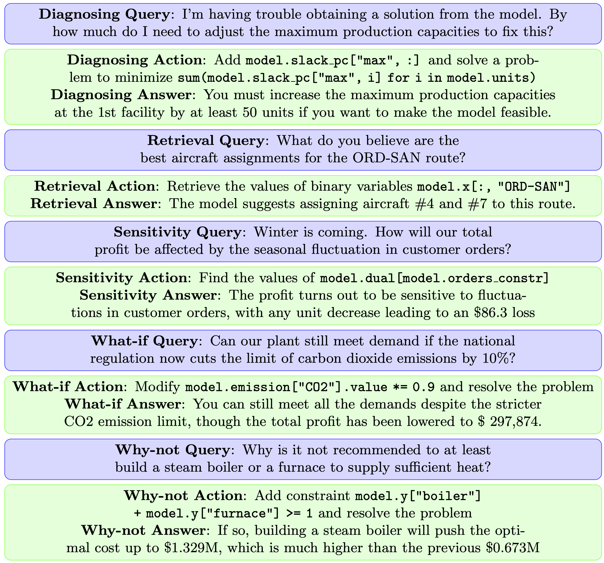

# OptiChat
Welcome to the [OptiChat](https://arxiv.org/abs/2501.08406) page. OptiChat is an interactive dialogue system powered by GPT4 LLM, augmented by Gurobi, Pyomo, predefined functions, and code generation, and aimed at helping practitioners interact with optimization models using natural language.

We aspire for this project to provide some valuable insights into **explaining optimization models using LLMs**, thereby bridging the gap between practitioners and optimization models 🚀. 

If you found this work useful, please cite this [preprint](https://arxiv.org/abs/2501.08406) and our [previous paper](https://www.tandfonline.com/doi/full/10.1080/03155986.2024.2385189) ([arXiv](https://arxiv.org/abs/2308.12923))

# Video Demo

[](https://youtu.be/7OEtEHfAdmo)


# Compatibility Notice
Please note that the requirements.txt file has not yet been updated, and you may encounter compatibility issues, particularly related to infeasible models. These issues may arise due to version mismatches or outdated dependencies. We are working to address this and will update the file as soon as possible. Thank you for your understanding and patience.

## Table of Contents
- [Overview](#overview)
- [Installation](#installation)
- [Tutorial](#tutorial)
- [Chat Example](#chat-example)
- [Model Library](#model-library)
- [Build Your Own Model and Test it](#build-your-own-model-and-test-it)
- [Citation](#citation)

# Overview
<a name="overview"></a>
## Motivation
Mathematical optimization models are extensively utilized to solve decision-making problems across various fields.
These models are usually developed by optimization experts but are used by practitioners without optimization expertise in various application domains.
As a result, practitioners often struggle to interact with and draw useful conclusions from optimization models independently.

## Scope
Model: OptiChat supports feasible/infeasible optimization model written in [Pyomo](http://www.pyomo.org).

Query: OptiChat supports diagnosing, retrieval, sensitivity, what-if and why-not queries, as exemplified in ([Query Example](#QuestionClass))

# Installation
<a name="installation"></a>
1. Install python3 and pip
2. Install python packages ```pip install -r requirements.txt``` (Please note we are still updating the requirements.txt)
3. Install Gurobi following the instructions in the youtube videos  [here](https://support.gurobi.com/hc/en-us/articles/4534161999889). For windows without admin access, follow the instructions
[here](https://support.gurobi.com/hc/en-us/articles/360060996432-How-do-I-install-Gurobi-on-Windows-without-administrator-credentials-)
4. Apply for an OpenAI API key [here](https://platform.openai.com/).  Add the key to your environment variables as ```OPENAI_API_KEY```
5. To check whether the installation of gurobi and GPT is successful, at the root directory, run ```pytest tests/```. If the test passes, you are good to go
6. Run app.py ```streamlit run app.py``` to use the chatbot

# Tutorial
<a name="tutorial"></a>
1. Browse files under Upload Model: Select your model (only support pyomo version .py file). There are a number of models in **Feas** and **Infeas** folders for you to test.

2. Process: Load your model to generate the initial description and get familiar with the problem context

3. Chat: Submit your queries using the chat interface ([Query Example](#QuestionClass))

Other buttons are intended for development and debugging purposes.


## Chat Example
<a name="chat-example"></a>
<p align="center">

</p>

Diagnosing queries focus on fixing infeasibility issues. 

Retrieval queries seek to extract relevant model data. 

Sensitivity queries measure the impact of parameter uncertainties on the optimal objective value. 

What-if queries evaluate significant changes in input parameters specified by users. 

Why-not queries investigate the counterfactual scenarios suggested by users.


# Model Library:
<a name="model-library"></a>
The model libary is located in the **Feas** and **Infeas** folders.

# Build Your Own Model and Test it:
<a name="build-your-own-model-and-test-it"></a>
At the current stage, OptiChat only supports optimization models written in Pyomo. A typical Pyomo model example is given as follows. 

**Please remember to set parameters "mutable=True" unless you are entirely certain that a parameter cannot be altered in any manner (eg. task duration in scheduling). This is because pyomo only has the mutable parameters in symbolic form, which is essential for GPT to work well.** 

When developing optimization models, consider adding comments using the "doc",
e.g., model.rho = Param(initialize=8, mutable=True, doc="Worker productivity (units per worker)").

OptiChat utilizes these doc strings as descriptions for specific model components to generate the overall model description.
If a doc is missing for a model component, OptiChat will first infer the description of this model component. 
Therefore, if you are familiar with the physical meanings of certain model components, include them in the "doc" to facilitate the model description process of OptiChat.

```python
from pyomo.environ import *

model = ConcreteModel()

# Set
model.t = Set(initialize=[1, 2, 3, 4, 5], doc="Time periods (weeks)")

# Parameters
model.rho = Param(initialize=8, mutable=True, doc="Worker productivity (units per worker)")
model.alpha = Param(initialize=6, mutable=True, doc="Trainer capability (workers per trainer)")
model.wage = Param(initialize=100, mutable=True, doc="Worker wages ($ per week per worker)")
model.si = Param(model.t, initialize={1: 10}, mutable=True, doc="Initial stock of goods (units)")  
model.wi = Param(model.t, initialize={1: 20}, mutable=True, doc="Initial number of workers (workers)")  
model.sf = Param(model.t, initialize={5: 100}, default=0, mutable=True, doc="Salary on firing ($)")  
model.d = Param(model.t, initialize={1: 100, 2: 600, 3: 300, 4: 400, 5: 200}, mutable=True, doc="Demand schedule (units)")  

# Variables
model.p = Var(model.t, within=NonNegativeReals, doc="Production level in period t (units)")
model.s = Var(model.t, within=NonNegativeReals, doc="Goods stored in period t (units)")
model.w = Var(model.t, within=NonNegativeReals, doc="Total potential productive workers (workers)")
model.h = Var(model.t, within=NonNegativeReals, doc="Workers hired (workers)")
model.f = Var(model.t, within=NonNegativeReals, doc="Workers fired (workers)")

# Constraints
def cb_rule(model, t):
    if t == 1:
        return model.s[t] == model.si[t] + model.p[t] - model.d[t]
    else:
        return model.s[t] == model.s[t - 1] + model.p[t] - model.d[t]
model.cb = Constraint(model.t, rule=cb_rule, doc="Commodity balance constraint")

def wb_rule(model, t):
    if t == 1:
        return model.w[t] == model.wi[t] - model.f[t] + model.h[t]
    else:
        return model.w[t] == model.w[t - 1] - model.f[t] + model.h[t]
model.wb = Constraint(model.t, rule=wb_rule, doc="Worker balance - between periods constraint")

def wd_rule(model, t):
    return model.w[t] >= model.p[t] / model.rho + (1 + 1 / model.alpha) * model.h[t]
model.wd = Constraint(model.t, rule=wd_rule, doc="Worker balance - job differentiation constraint")

# Objective
model.obj = Objective(expr=sum(10 * model.s[t] + (model.wage + model.sf[t]) * model.w[t] for t in model.t), sense=minimize)
```

# Citation
<a name="citation"></a>
Cite us ❤️
```bibtex
@misc{OptiChat2025,
      title={OptiChat: Bridging Optimization Models and Practitioners with Large Language Models}, 
      author={Hao Chen and Gonzalo Esteban Constante-Flores and Krishna Sri Ipsit Mantri and Sai Madhukiran Kompalli and Akshdeep Singh Ahluwalia and Can Li},
      year={2025},
      eprint={2501.08406},
      archivePrefix={arXiv},
      primaryClass={cs.HC},
      url={https://arxiv.org/abs/2501.08406}, 
}
```

```bibtex
@article{OptiChat2023,
   author = {Chen, Hao and Constante-Flores, Gonzalo~E.  and Li, Can},
   doi = {10.1080/03155986.2024.2385189},
   issue = {0},
   journal = {INFOR: Information Systems and Operational Research},
   publisher = {Taylor \& Francis},
   title = {Diagnosing infeasible optimization problems using large language models},
   volume = {62},
   number = {4},
   pages = {1-15},
   url = {https://doi.org/10.1080/03155986.2024.2385189},
   year = {2024},
}
```

